#ORM (Object Relational Mapping) with JPA (Java Persistence API)
## Day 1: Introduction to ORM
[Tutorial for JPA](http://www.tutorialspoint.com/jpa/jpa_introduction.htm)
- Java Persistence API is a source to store business entities (java objects) as relational entities (db tables) 
- Challenges:  
  - Table structure in db vs graph structure in objects (references containing references ...)
  - Inheritance: Objects with inheritance hierarchy to be mirrored in tables
  - DB tables contains only scalar values like int and string.


###Pros and Cons  
  - Pros:
    - ORM typically reduces the amount of code that needs to be written
    - Avoids low level JDBC and SQL code
    - rovides database and schema independence
    - It allows us to use the OO-paradigm  
  - Cons:
    - The high level of abstraction can obscure what is actually happening in the implementation code. 
    - Heavy reliance on ORM software has been cited as a major factor in producing poorly designed databases.
    - There are a variety of difficulties that arise when considering how to match an object system to a relational database. 
- Our goal is to uphold the illusion that we are only working in an OO world (even when manipulating data)  


###Some questions that arise  
- How are columns, rows, tables mapped to objects?
- How are relationships handled?
- How is OO inheritance mapped to relational tables?
- How is composition and aggregation handled?
- How are conflicting type systems between databases handled?
- How are objects persisted?
- How are different design goals handled:
  - Relational model designed for data storage/retrieval
  - Object Oriented model is about modelling behaviour 


###Java vs DB: Mismatch issues
- Example – collections versus tables 
  - Java/C# use collections to manage lists of objects
  - Databases uses tables to manage lists of entities

- Example – blobs versus objects
  - Databases uses blobs to manage large objects as simple binary data
  - Java/C# use objects with behaviors 


###JPA providers:  
  - Hybernate  
  - **EclipseLink** [reference](https://en.wikibooks.org/wiki/Java_Persistence/EclipseLink)  
  - Toplink  


###JPA architecture: javax.Persistence  
  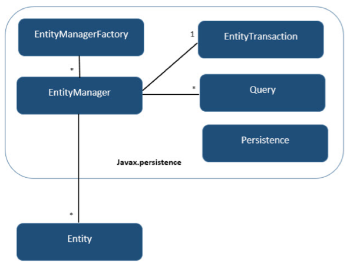  


- Entities are managed by the entity manager, which is represented by javax.persistence.EntityManager instances. 
- Each EntityManager instance is associated with a persistence context: a set of managed entity instances that exist in a particular data store. 
- A persistence context defines the scope under which particular entity instances are created, persisted, and removed. 
- The EntityManager interface defines the methods that are used to interact with the persistence context.
- The entityManager -   
  - manages the state and life cycle of entities as well as querying entities within a persistence context.
  - is responsible for creating and removing persistent entity instances and finding entities by their primary key. 
  - can lock entities for protecting against concurrent access by using optimistic or pessimistic locking.
  - can use JPQL queries to retrieve entities following certain criteria.  


###Persistence.xml: the Persistence Unit (PU)
  - registers the database and specify the entity classes 
  - Drop and Create, Create or ...  
  - Remember to ALWAYs **clean and build** the project after changing the PU.  
 
- The entities  
  - Try creating an entity from a database  
  - Try creating a database from an entity  
  - Benefits of either way:
    - Easier to write the objects and let JPA worry about the tables  
    - When JPA creates the Entity we get a few Named Queries "for free".  

Example:  
```
    @NamedQuery(name = "Customer.findAll", query = "SELECT c FROM Customer c"),
    @NamedQuery(name = "Customer.findByCustomerNumber", query = "SELECT c FROM Customer c WHERE c.customerNumber = :customerNumber"),
    @NamedQuery(name = "Customer.findByCustomerName", query = "SELECT c FROM Customer c WHERE c.customerName = :customerName"),
    @NamedQuery(name = "Customer.findByContactLastName", query = "SELECT c FROM Customer c WHERE c.contactLastName = :contactLastName"),
    @NamedQuery(name = "Customer.findByContactFirstName", query = "SELECT c FROM Customer c WHERE c.contactFirstName = :contactFirstName"),
    @NamedQuery(name = "Customer.findByPhone", query = "SELECT c FROM Customer c WHERE c.phone = :phone"),
    @NamedQuery(name = "Customer.findByAddressLine1", query = "SELECT c FROM Customer c WHERE c.addressLine1 = :addressLine1"),
    @NamedQuery(name = "Customer.findByAddressLine2", query = "SELECT c FROM Customer c WHERE c.addressLine2 = :addressLine2"),
    @NamedQuery(name = "Customer.findByCity", query = "SELECT c FROM Customer c WHERE c.city = :city"),
    @NamedQuery(name = "Customer.findByState", query = "SELECT c FROM Customer c WHERE c.state = :state"),
    @NamedQuery(name = "Customer.findByPostalCode", query = "SELECT c FROM Customer c WHERE c.postalCode = :postalCode"),
    @NamedQuery(name = "Customer.findByCountry", query = "SELECT c FROM Customer c WHERE c.country = :country"),
    @NamedQuery(name = "Customer.findByCreditLimit", query = "SELECT c FROM Customer c WHERE c.creditLimit = :creditLimit"),
    @NamedQuery(name = "Customer.findCount", query = "SELECT COUNT(c) FROM Customer c")})
```
  
## Getting started: set up the first project.  
1. Create the project.
2. Create a database and connect (for this demo I use mysql database: jpa1)
3. Add the MYSQL JDBC Driver to the project libraries (maven: [add this dependency to POM.XML](https://mvnrepository.com/artifact/mysql/mysql-connector-java/5.1.39#maven)  
4. Create a new Persistance Unit (right click project and choose new...) choose EclipseLink JPA 2.1 (Should be the default choice for the Persistence Provider) 
5. Create new file -> Entity Class. Name it Person. Then create the file below with an EntityManager based on the Persistence Unit See how running the persist() method creates a new table in the database called person with ID, Age and Name. To get the created SQL from EclipseLink insert the following 2 property lines in to the persistence.xml. :  
```
<property name="eclipselink.logging.level.sql" value="FINE"/>  
<property name="eclipselink.logging.parameters" value="true"/> 
```   


###Annotations    
| Annotation | Description                                                           |
|------------|-----------------------------------------------------------------------|
|@Entity     |	This annotation specifies to declare the class as entity or a table. |
|@Table      |	This annotation specifies to declare table name.|
|@Basic	     |  This annotation specifies non constraint fields explicitly.|
|@Embedded   |	This annotation specifies the properties of class or an entity whose value instance of an embeddable class.|
|@Id	     |  This annotation specifies the property, use for identity (primary key of a table) of the class.|
|@GeneratedValue|	This annotation specifies, how the identity attribute can be initialized such as Automatic, manual, or value taken from sequence table.|
|@Transient  | This annotation specifies the property which in not persistent i.e. the value is never stored into database.|
|@Column     | This annotation is used to specify column or attribute for persistence property.|
|@SequenceGenerator   |	This annotation is used to define the value for the property which is specified in @GeneratedValue annotation. It creates a sequence.|
|@TableGenerator      |	This annotation is used to specify the value generator for property specified in @GeneratedValue annotation. It creates a table for value generation.|
|@AccessType	| This type of annotation is used to set the access type. If you set @AccessType(FIELD) then Field wise access will occur. If you set @AccessType(PROPERTY) then Property wise assess will occur.|
|@JoinColumn	| This annotation is used to specify an entity association or entity collection. This is used in many- to-one and one-to-many associations.|
|@UniqueConstraint    |	This annotation is used to specify the field, unique constraint for primary or secondary table.|
|@ColumnResult	| This annotation references the name of a column in the SQL query using select clause.|
|@ManyToMany	| This annotation is used to define a many-to-many relationship between the join Tables.|
|@ManyToOne	| This annotation is used to define a many-to-one relationship between the join Tables.|
|@OneToMany	| This annotation is used to define a one-to-many relationship between the join Tables.|
|@OneToOne	| This annotation is used to define a one-to-one relationship between the join Tables.|
|@NamedQueries	| This annotation is used for specifying list of named queries.|
|@NamedQuery	| This annotation is used for specifying a Query using static name.|  


###The Entity class
- Typically, an entity represents a table in a relational database, 
- Each entity instance corresponds to a row in that table.  
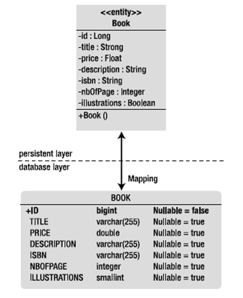
- Entity classes are very similar to Java beans in that they follow a set of rules.
- Entity Classes must (:
  - be annotated with the @Entity annotation.
  - have (at least) a public or protected, no-argument constructor. 
  - The class must not be declared final. No methods or persistent instance variables must be declared final.
  - If an entity instance is passed by value as a detached object, the class must implement the Serializable interface.
  - Entities may extend both entity and non-entity classes, and non-entity classes may extend entity classes.
  - Persistent instance variables must be declared private, protected, or package-private and can be accessed directly only by the entity class's methods.  
  
###Entity example: 
 
```
  ** @Entity **
   public class Book
   {
	  **@Id** private Long id;
	  private String title;
	  private Float price;
	  private String description;
	  private String isbn;
	  private Integer nbOfPage;
	  private Boolean illustrations;
	  public Book() { }
  // Getters, setters
  }  
```  
Above example shows how 2 annotations is enough to turn this class into a JPA entity.
This is done by using the principle: [Configuration by Exception](http://stackoverflow.com/questions/34125441/what-is-exactely-a-configuration-by-exception-in-jpa)


###Let's demo!  
  


###GenerationType
  
- Choose Identity when using MySQL (auto_increment)
- Choose Sequence with Oracle

###Composite primary key
- 2 ways <more info and examples here>
  - With an Id class
  - With an embeddable class 
  - [See further explanation here](http://www.objectdb.com/java/jpa/entity/id#Composite_Primary_Key_)

These can be used in the find() method of the EntityManager  

###DateTime
- Date object
```
@Temporal(TemporalType.DATE)
private Date dateOfBirth;
```   
- Timestamp
``` 
@Temporal(TemporalType.TIMESTAMP)
private Date creationDate;
```

###Transient 
- when fields should be excluded from persisting   

```@Transient
private int age; 
```  


###Enums 
To ensure that the actual text (and not just the enum index) is stored in the entity table: 
```
public class Customer {
    **@Enumerated**(EnumType.STRING)
    private CustomerType customerType;
} 
```
And the Enum CustomerType: 
```
public enum CustomerType {
  GOLD, 
  SILVER,
  IRON, 
  RUSTY 
}
```


###Entity Manager example:   

```java  
Book2 book = new Book2(); //Just a POJO - an entity class can be used as a regular object in rest of application
book.setDescription("some desc"); 
EntityManagerFactory emf;  
emf = Persistence.createEntityManagerFactory(“pu-x");  
EntityManager em = emf.createEntityManager();  
em.getTransaction().begin();
em.persist(book);      //Here the object becomes 'managed' to load it into db
em.getTransaction().commit();
em.close();    
em.remove(book);  //No longer managed (just a POJO again)  
```   


###Entity life cycle
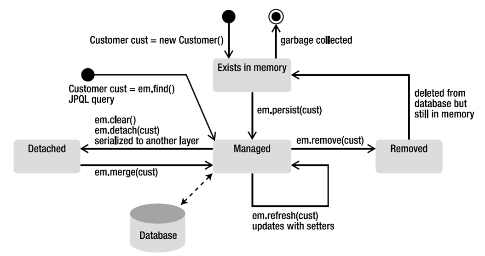  


###Chicken or Egg   
*Which came first... ??*


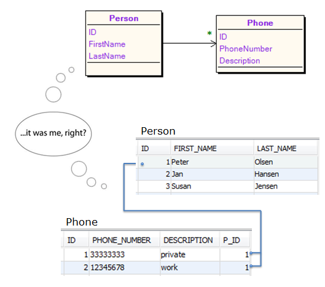  

<br>
<br>
<br>
<br>
<br>
<br>
<br>
<br>
<br>
<br>
<br>
<br>
<br>
<br>
<br>
<br>
<br>
<br>
<br>
<br>
<br>

### Queries 
- Example of using a 
 

- Example of using a named query to select an aggregated value (rather than an object)
```
//Inside a JPA entity class: Customer
@NamedQuery(name = "Customer.findCount", query = "SELECT COUNT(c) FROM Customer c")})

//In a calling method from a facade class:
Query query3 = em.createNamedQuery("Customer.findCount");
int count = ((Number)query3.getSingleResult()).intValue();
System.out.println(count);
```


###Let's demo!  
- Create table from Entity object
- Create Entity from table.

  


###Persist a dirty object
- When updating a table row in the database with a new object (with same id)
	```
      em.getTransaction().begin();
      em.merge(myChangedObject);
      em.getTransaction().commit();
```
- As long as the id (primary key) is the same merge() will persist the new data into the specific table row.

###Resources:
 [jpa example](https://hendrosteven.wordpress.com/2008/03/06/simple-jpa-application-with-netbeans/)
 [more details](http://www.javacodegeeks.com/2015/02/jpa-tutorial.html)


###Exercise 1 - Basic JPA
[Find the exercise here](exercises/JPA_MappingExercise-1.pdf)


##Day 2 - JPA relationships
### Relationships
[JPA relationships by tutorialspoint](http://www.tutorialspoint.com/jpa/jpa_entity_relationships.htm)  

###Collections and Maps (basic types)   

With a java List:  

```
@ElementCollection(fetch = FetchType.LAZY)
 private List<String> hobbies= new ArrayList();
```

With a java Map: 

```
 @ElementCollection(fetch = FetchType.LAZY)
 @MapKeyColumn(name = "PHONE") 
 @Column(name = "Description")  //Name of the Value column
 private Map<String, String> phones = new HashMap();
``` 

| Cardinality | Direction               |  Example |
|-------------|-------------------------|----------|
| One-to-one  | Unidirectional  | person and car |
| One-to-one  | Bidirectional   | person and spouse|
| One-to-many | Unidirectional  | workplace and work station |
| Many-to-one/one-to-many | Bidirectional| student and teacher |
| Many-to-one | Unidirectional  | student and school |
| Many-to-many| Unidirectional  | person and phone |
| Many-to-many| Bidirectional   | employee and company car |   


###Bidirectional relationships
The inverse side of a bidirectional relationship must refer to its owning side by use of the mappedBy element:  
```
public class Customer { 
  //...
  @OneToMany(mappedBy = "customer") //Here we tell (EM) Where to find the owning side
  private List<Address> addresses = new ArrayList();   
```   
```  
@Entity
public class Address ..{
  private static final long serialVersionUID = 1L;
  ..
  @ManyToOne
  private Customer customer; //This is the owning side (The side that holds the Foreign Key in DB)
```
- For many-to-many bidirectional relationships either side may be the owning side

### 2 examples
Many to One relationship  
  


Many to many relationship:  
  

- when bidirectional be ALERT!! on setting the reference on both objects  
 
```java
    PhoneNo phone = new PhoneNo();
    Person person1 = new Person();
    person.addPhone(phone); //HERE
    phone.setPerson(person1); //AND HERE
    phone.setNumber("+45 3225 8921");
    em.persist(person1);
    em.persist(phone);
```

Example of a self referenced bidirectional relationship. Eg. A person can be a supervisor for other persons and can himself be supervised by a person. In order to set this up we need both a reference to a supervisor in each person and also a list of persons to supervise:  

```
    @ManyToOne
    private Person supervisor;
    @OneToMany(mappedBy = "supervisor") 
    private List<Person> supervised;
```  
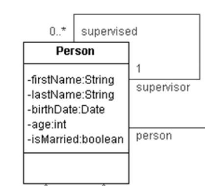


###Lazy loading (fetching)
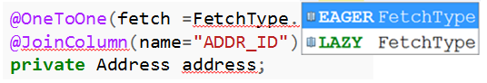  

- The cost of retrieving and building an object's relationships far exceeds the cost of selecting the object
- The solution to this issue is lazy fetching (lazy loading). 
- Lazy fetching allows the fetching of a relationship to be deferred until it is accessed


###Cascading
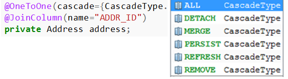   
- Cascade is normally used to model dependent relationships, such as Order -> OrderLine.  
- Cascading the orderLines relationship allows for the Order's -> OrderLines to be persisted, removed, merged along with their parent. 

1. ALL: this is means that a references object is being treated in all ways as the main object.
2. Detach: Detached objects are useful in situations in which an EntityManager is not available and for transferring objects between different EntityManager instances.
3. Merge: The content of the specified detached entity object is copied into an existing managed entity object with the same identity (i.e. same type and primary key). If the EntityManager does not manage such an entity object yet a new managed entity object is constructed. The detached object itself, however, remains unchanged and detached. This makes merge well suited to a method like `facade.add(person)` - where person is a detached object holding the changes we want to make to the person table tuble with that same id.
4. Persist: is where we register a new object with the Entity Manager (making it a managed object) The object is commited to database only when the transaction is commited (Persist can only work inside a transaction like   ```java  
    em.getTransaction().begin();
    em.persist(customer);
    em.getTransaction().commit();
```
5. Refresh: Overwrites data in the managed object with data from the database.
6. Remove: Removes the object from the database:
```
	Employee employee = em.find(Employee.class, 1);
    em.getTransaction().begin();
    em.remove(employee);
    em.getTransaction().commit();
``` 


##Day3 - Inheritance  
Look at this example
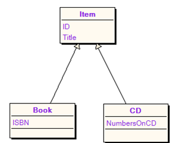

```
//ITEM:
Item item = new Item();
item.setTitle("Title for an Item");
//BOOK:   
Book book = new Book();
book.setIsbn("9780828815130");
book.setTitle("The Da Vinci Code");
//CD:
CD cd = new CD();
cd.setTitle("Mylo Xyloto");
cd.setNumbersOnCD(11);
```

###3 strategies  
  - Single table
    - DTYPE collumn and null values
  - Joined
    - One table for the super class and one for each sub class containing the extended data
  - Table per Class   

### Single-Table strategy: 

- Single table inheritance is the simplest, and default, and often the best performing solution
- A single table is used to store all of the instances of the entire inheritance hierarchy. 
- The table will have a column for every attribute of every class in the hierarchy. 
- A discriminator column is used to determine which class the particular row belongs to.
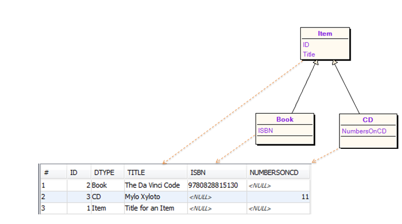

#### Single-Table example code:
ITEM: 
```
@Entity
@Inheritance(strategy = InheritanceType.SINGLE_TABLE)
public class Item {
  @Id
  @GeneratedValue(strategy = GenerationType.AUTO)
  private Long id;
  private String title;
  //Getters Setters
}
```
BOOK:  
``` @Entity
public class Book extends Item{
 private String isbn;
//Getters Setters
}
```
CD:
```@Entity
public class CD extends Item {
private int numbersOnCd;
//Getters Setters
}
```
SQL (in DB):
```
CREATE TABLE ITEM (
  ID BIGINT NOT NULLPRIMARY KEY, 
  DTYPE VARCHAR(31), -- Here is the discriminator collumn.
  TITLE VARCHAR(255), 
  ISBN VARCHAR(255), 
  NUMBERSONCD INTEGER
);
```
#### PROs
- The default 
- Simple to understand
- Works well when the hierarchy is relatively simple and stable. 

#### CONs
- Adding new entities to the hierarchy, or adding attributes to existing entities, involves adding new columns to the table, migrating data, and changing indexes. 
- All columns of the child entities must be Nullable.
- If mapping to an existing database schema, our table may not have a class discriminator column 

### Joined table strategy
- Joined inheritance is the inheritance strategy that most closely mirrors the object model into the data model
- A table is defined for each class in the inheritance hierarchy to store only the local attributes of that class
- Each table in the hierarchy must also store the object's id (primary key), defined in the root class
- All classes in the hierarchy must share the same id attribute
- A discriminator column is used to determine which class the particular row belongs to.
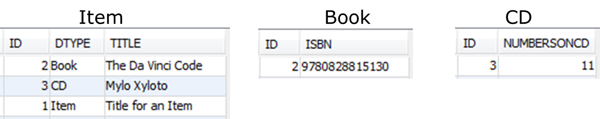


### Joined table example code
```
@Entity
@Inheritance(strategy = InheritanceType.JOINED)
public class Item {
  @Id
  @GeneratedValue(strategy = GenerationType.AUTO)
  private Long id;
  private String title;
  //Getters Setters
}
```
```
@Entity
public class Book extends Item{
 private String isbn; // No id (only relevant for the tables)
//Getters Setters
}
```
```@Entity
public class CD extends Item {
  private int numbersOnCd;
//Getters Setters
}
```
<div align="right"> 
```sql
CREATE TABLE ITEM (
  ID BIGINT NOT NULL PRIMARY KEY, 
  DTYPE VARCHAR(31), 
  TITLE VARCHAR(100)
);
CREATE TABLE CD (
  ID BIGINT NOT NULL PRIMARY KEY, 
  NUMBERSONCD INTEGER,
  CONSTRAINT FK_CD_ID FOREIGN KEY (ID) REFERENCES ITEM(ID)
);
CREATE TABLE BOOK (
  ID BIGINT NOT NULL PRIMARY KEY ,  
  ISBN VARCHAR(14), 
  CONSTRAINT FK_BOOK_ID FOREIGN KEY (ID) REFERENCES ITEM(ID)
);
```
</div> 

#### PROs and CONs
- PROs
  - The joined-subclass strategy is intuitive and is close to what we know from OO-inheritance
- CONs
  - Querying can have a performance impact. The strategy is called joined because, to reassemble an instance of a subclass, the subclass table has to be joined with the root class table. The deeper the hierarchy, the more joins needed to assemble a leaf entity
-  If mapping to an existing database schema, our table may not have a class discriminator column 

### Inheritance strategy: Table-Per-Class
- From a database point of view, this strategy denormalizes the model 
- Causes all root entity attributes to be redefined in the tables of all leaf entities that inherit from it.  
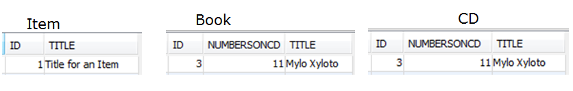

With the table-per-concrete-class strategy, there is:
- no shared table
- no shared columns
- no discriminator column

#### PROs and CONs
- Pros
  - Performs well when querying instances of one entity 
- Cons
  - Polymorphic queries across a class hierarchy more expensive than the other strategies (e.g., finding all the items, including CDs and books); it must query all subclass tables using a UNION operation, which is expensive when a large amount of data is involved.
  - Entity Support for this strategy is optional in JPA 2.0.


### Lets Demo
  


###Exercise 3 - Inheritance
[Find the exercise here](exercises/JPA_MappingExercise-3.pdf)

##Day 4 - JPQL
### Quering with JPQL
- JPA provides several querying mechanisms:
  - JPQL  
  - Criteria API
  - Native SQL Queries

- We will focus only on 
  - **JPQL ** (Java Persistence Query Language).

- JPQL is the query language defined by JPA. 
- It is similar to SQL, **BUT** operates on 
  - objects, 
  - attributes and 
  - relationships 
  - instead of tables and columns as in SQL

### JPQ queries - 2 kinds
- Named Queries 
  - Named queries are used for a static queries that will be used many times in the application. 
  - The advantage of a named query is that it can be defined once, in one place, and reused in the application.
  - Declaring a Named Query: 
```
@NamedQuery( 
  name="findAllEmployeesInCity", 
  query="Select emp from Employee emp where emp.address.city = :city" 
) 
public class Employee { ... }
```
Executing a Named Query:
```
EntityManager em = getEntityManager(); 
Query query = em.createNamedQuery("findAllEmployeesInCity"); 
query.setParameter("city", "Ottawa"); 
List<Employee> employees = query.getResultList();
```

- Dynamic Queries
  - Dynamic queries are normally used when the query depends on the context. 
  - For example, depending on which items in the query form were filled in, the query may have different parameters. 
  - Dynamic queries are also useful for uncommon queries.
  - [Tutorial for JPQL syntax and examples](https://en.wikibooks.org/wiki/Java_Persistence/JPQL)

### Lets Demo
  


###Exercise 4 - JPQL
[Find the exercise here](exercises/JPQL_Exercise.docx)
